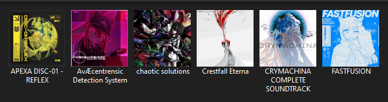

# covericonator
A small program for converting album cover art to folder icons. Now when you open your music library you'll see neat artwork and not folders... with said artworks...

# Usage
Make sure you have [.NET Runtime 8](https://dotnet.microsoft.com/download/dotnet/8.0) installed. 
After that, it's very simple to use; just drag your album folders into the executable and it (should) work.

Importantly, this program assumes your albums have a `cover.jpg`/`cover.png`/etc. file in the root or any of the subfolders; if not, you can use a tag editor to extract the artwork.

> [!NOTE]
> Windows is a bit weird when it comes to programatically modifying icons. If you simply pass your albums through covericonator, you might notice it didn't work as expected. The solution I've found to fix broken icons, albeit not perfect, is:
>
> 1. Open the folder properties
> 2. Navigate to the Customize tab
> 3. ...Do nothing, and just click OK
> 4. Exit and re-enter the parent folder
>
> If you know of a way to solve this problem, please let me know.
